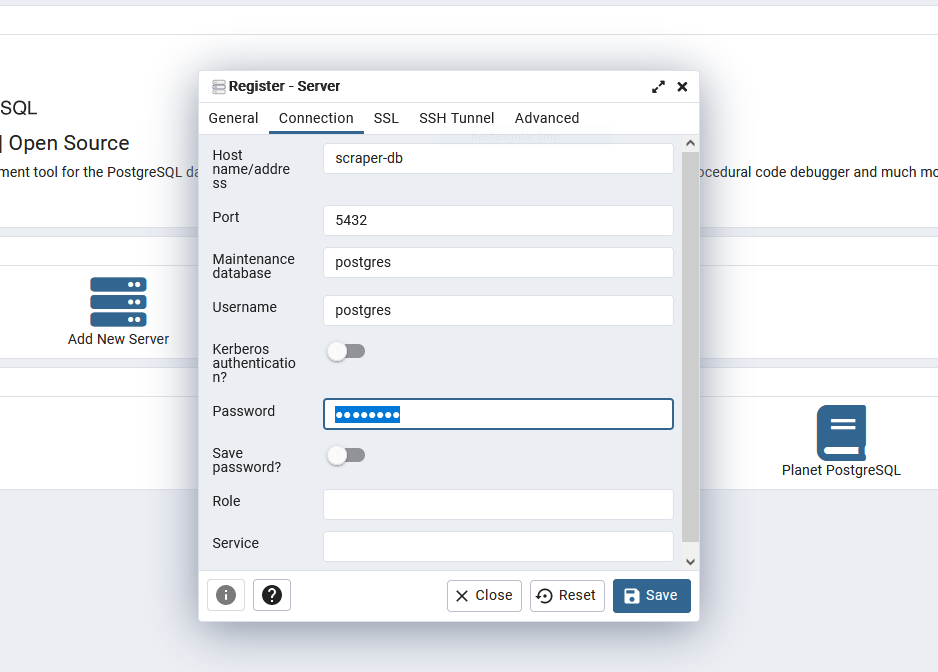

# Database

There's not too much to say here.

The database is a [standard postgres image](./Dockerfile) augmented with a simple startup script to create a `dev` and `test` database.

An out-of-the-box pgAdmin server is included. Once up, you can log in to it by navigating to [localhost:8080](localhost:8080) with the credentials *defined in the [top-level compose file](../docker-compose.yml)** (`hi@me.com`, `password`). You must add the server to interact with it. Click "Add Server", `name` it whatever you want, navigate to the connection tab, fill in the details* (default DB password: `postgres` - screenshot below) and click save.

Both are wired up (database URL and credentials, ports etc) in the [top-level compose file](../docker-compose.yml).

The database schema and CRUD are currently handled by [SQLModel](https://sqlmodel.tiangolo.com/) (really, [SQLAlchemy](https://www.sqlalchemy.org/)) which serves as an ORM in the [scraping code](../scraper/scraper/models.py).

